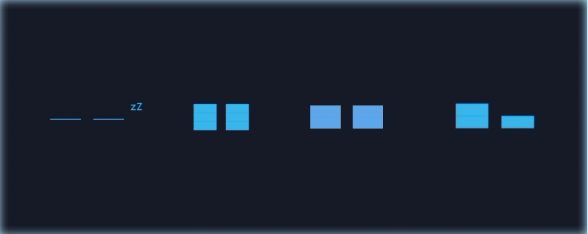

**Gunakan Termux:float (Floating window) agar lebih menarik 😸**
<details>
  <summary>💧 Disini :</summary>
<br>
  
- Termux:Float [apk](https://f-droid.org/repo/com.termux.window_15.apk)
- atau kunjungi F-Droid untuk mendapatkan versi terbaru (jika ada)

</details>

## ⚙️ Installation
```
# Package Install 📦
apt install python git play-audio -y

# Cloning repo 📥
git clone https://github.com/anonvict/py-eye.git

cd py-eye

# Run 🐍
python eye.py
```
---
**Respon suara bisa di tambah, aku memakai paket play-audio 😸 untuk Termux versi android 5 kemungkinan tidak tersedia paket `play-audio` bisa memakai mpv**
```python
# Feedback suara aku memakai play-audio (sesuaikan!)
def play_sound():
    os.system(
        'play-audio "sound/robot-notif.wav" '
        '> /dev/null 2>&1 &'
    )
```
---

> **Jika animasi mata rusak alias ada seperti garis lubang hitam di tengah eskpresi (tidak auto block full) kamu bisa zoom layar atau cubit layar terminal/termux/float. sesuaikan hingga masalah garis hitam menghilang.**


---

<details>
  <summary>💡 Upgrade?</summary>
<br>
  
- Menambahkan lebih banyak ekspresi 🤩
- Menggabungkannya dengan Jam/waktu. (menampilkan animasi >> waktu)
- Menambah sound effect agar lebih hidup 🐍
- termux-sensor -s "kx022 ACCELEROMETER" (woilah, jika kalian smart, mungkin bisa di integrasikan dengan sensor itu, ~canda~)
- dan lain²
</details>

### 💌 Inspired by:
> (Dennis Hoelscher) in [repo](https://github.com/FluxGarage/RoboEyes)
